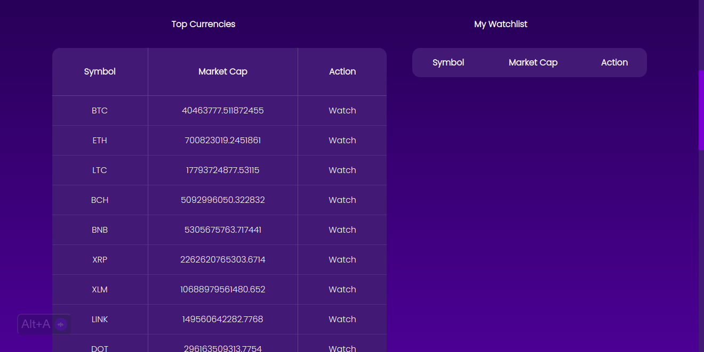
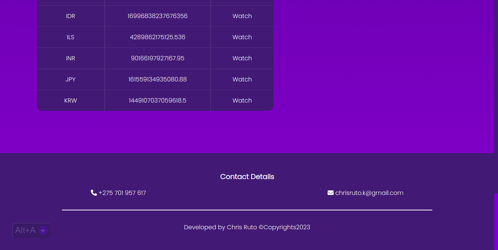

# Crypyo Watch
## _Watch Your Favorite Crypto Coins With Ease_

Crypto Watch is a website that showcases the market cap of cryptocurrencies along with their symbols, providing users with valuable insights into the world of digital assets.

## Features

- View real-time market cap data for currencies.
- Add currencies to your watchlist to keep track of your favorite cryptocurrencies.
- Remove currencies from your watchlist when you no longer wish to monitor them.
- Search for a currency to access real-time data.

## Tech

Crypto Watch uses the following to function:

- HTML
- CSS
- Vanilla Javascript
- Coingecko API

## Bugs

- The API has a request rate limit of only 30 requests per minute, which can lead to timeouts and slow response times.
- The search results return the market cap while the displayed currencies on load return the total market cap due to a difference in the API endpoints.

These limitations are a result of the free API package, which restricts available endpoints and enforces a low request rate limit. Upgrading to a more comprehensive package is the recommended solution to enhance Crypto Watch's functionality and user experience.

## Screenshots

## License

MIT License

Copyright (c) 2023 ckorir

Permission is hereby granted, free of charge, to any person obtaining a copy
of this software and associated documentation files (the "Software"), to deal
in the Software without restriction, including without limitation the rights
to use, copy, modify, merge, publish, distribute, sublicense, and/or sell
copies of the Software, and to permit persons to whom the Software is
furnished to do so, subject to the following conditions:

The above copyright notice and this permission notice shall be included in all
copies or substantial portions of the Software.

THE SOFTWARE IS PROVIDED "AS IS", WITHOUT WARRANTY OF ANY KIND, EXPRESS OR
IMPLIED, INCLUDING BUT NOT LIMITED TO THE WARRANTIES OF MERCHANTABILITY,
FITNESS FOR A PARTICULAR PURPOSE AND NONINFRINGEMENT. IN NO EVENT SHALL THE
AUTHORS OR COPYRIGHT HOLDERS BE LIABLE FOR ANY CLAIM, DAMAGES OR OTHER
LIABILITY, WHETHER IN AN ACTION OF CONTRACT, TORT OR OTHERWISE, ARISING FROM,
OUT OF OR IN CONNECTION WITH THE SOFTWARE OR THE USE OR OTHER DEALINGS IN THE
SOFTWARE.